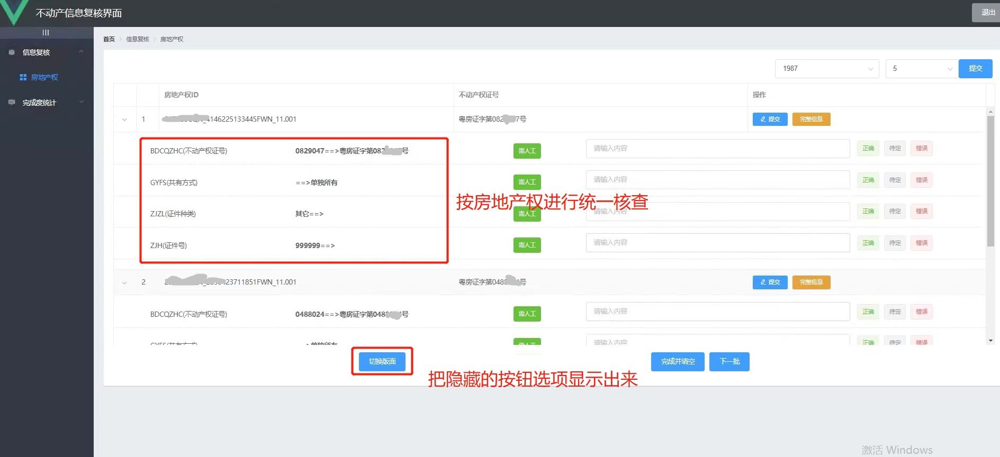
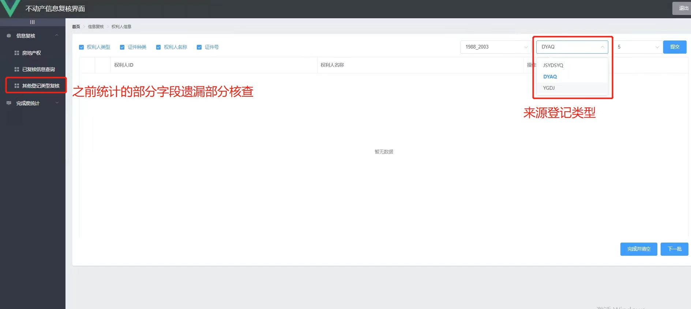
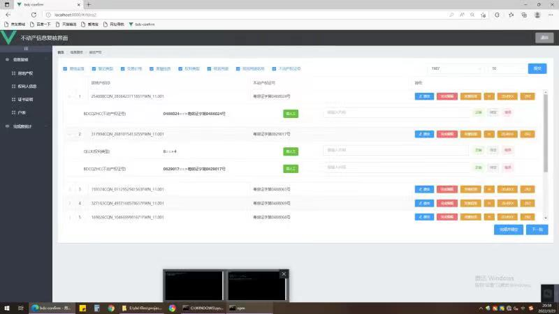
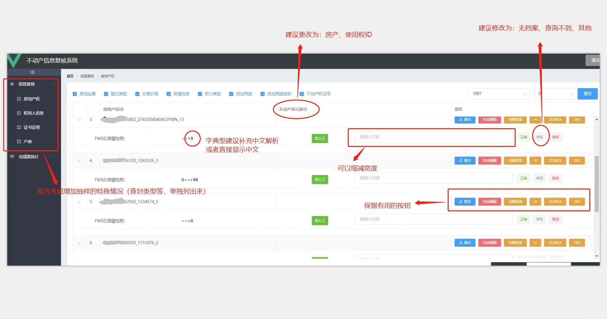

# bdc-confirm

项目描述：页面为不动产数据复核界面的初版，界面风格和最终界面相近，但非最终界面。

## ScreenShots

#### Version 1.0



#### Version 1.1



### Version1.2 完整界面



### Version 1.3（修改意见）



## Project setup

```
npm install
```

### Compiles and hot-reloads for development
```
npm run serve
```

### Compiles and minifies for production
```
npm run build
```

### Customize configuration
See [Configuration Reference](https://cli.vuejs.org/config/).

